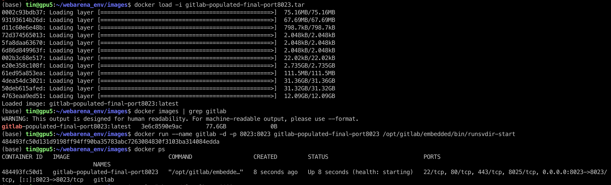
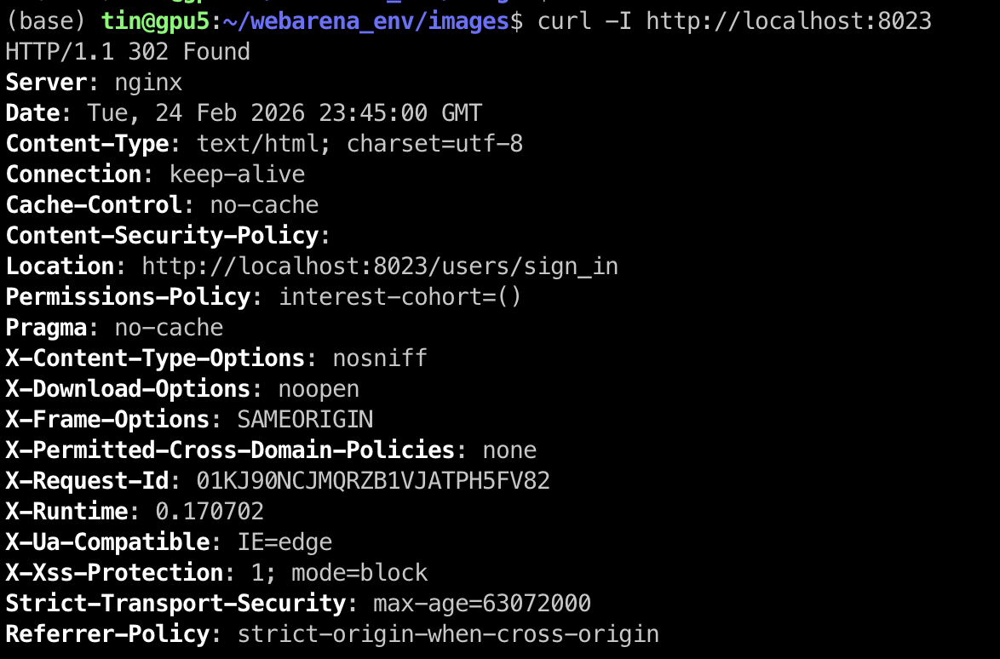

# WebArena GitLab Setup & Workflow Guide

## Overview

This guide documents the complete workflow for running the WebArena
GitLab environment on a server using Docker.

It covers:

1.  Downloading the GitLab Docker image (via `.sh` script)
2.  Loading the image into Docker
3.  Running the container
4.  Verifying the environment
5.  Accessing it from your laptop
6.  Resetting the root password
7.  Useful management commands

------------------------------------------------------------------------

# 1. Download Script (What It Does)

Script name:

    download_webarena_gitlab.sh

### What the script does:

-   Creates workspace: `~/webarena_env/images`
-   Downloads the GitLab WebArena Docker image:
    `gitlab-populated-final-port8023.tar`
-   Supports resume (`wget -c` or `curl --continue-at -`)
-   Prints the final file location

### Run the script:

    chmod +x download_webarena_gitlab.sh
    ./download_webarena_gitlab.sh

Verify download:

    ls -lh ~/webarena_env/images

------------------------------------------------------------------------

# 2. Load the Docker Image

After download finishes:

    cd ~/webarena_env/images
    docker load -i gitlab-populated-final-port8023.tar

Expected success message:

    Loaded image: gitlab-populated-final-port8023

Verify image exists:

    docker images | grep gitlab

------------------------------------------------------------------------

# 3. Run the GitLab Container

Start GitLab:

    docker run --name gitlab -d -p 8023:8023     gitlab-populated-final-port8023     /opt/gitlab/embedded/bin/runsvdir-start

Check it is running:

    docker ps

------------------------------------------------------------------------

# 4. Wait for GitLab to Boot

GitLab takes 3--10 minutes to initialize.

Check readiness:

    curl -I http://localhost:8023

Expected output when ready:

    HTTP/1.1 302 Found

or

    HTTP/1.1 200 OK

If you see:

    HTTP/1.1 502 Bad Gateway

Wait a few more minutes.

------------------------------------------------------------------------

# 5. Access from Laptop (Recommended)

From your laptop:

    ssh -L 8023:localhost:8023 gpu5

Then open in browser:

    http://localhost:8023

------------------------------------------------------------------------

# 6. Reset Root Password

Enter container:

    docker exec -it gitlab bash

Reset root password:

    gitlab-rake "gitlab:password:reset[root]"

Set a strong password (12+ characters, uppercase, lowercase, number,
symbol).

Exit container:

    exit

Login in browser:

-   Username: root
-   Password: (new password)

------------------------------------------------------------------------

# 7. Optional: Set External URL

Replace with your server IP:

    docker exec gitlab sed -i     "s|^external_url.*|external_url 'http://131.204.27.97:8023'|"     /etc/gitlab/gitlab.rb

    docker exec gitlab gitlab-ctl reconfigure

------------------------------------------------------------------------

# 8. Verify Environment Status

Check container:

    docker ps

Check logs:

    docker logs -f gitlab

Test HTTP:

    curl -I http://localhost:8023

------------------------------------------------------------------------

# 9. Container Management Commands
🟢 Option A — Just stop GitLab (most common)

If you’re done testing and just want GitLab off:

    docker stop gitlab

That cleanly shuts down the container.

Later, you can restart it with:

    docker start gitlab

This is the normal workflow.

🟡 Option B — Remove the container (but keep the image)

If you want to fully remove the running instance:

    docker rm -f gitlab

This deletes the container, but the Docker image still exists.

You can re-run it later using:

    docker run ...

🔴 Option C — Remove everything (container + image)

    docker rm -f gitlab
    docker rmi gitlab-populated-final-port8023

------------------------------------------------------------------------

# Access URLs

Via SSH tunnel (recommended):

    http://localhost:8023

Direct access (if firewall allows):

    http://131.204.27.97:8023

------------------------------------------------------------------------

You now have a fully working WebArena GitLab environment.
